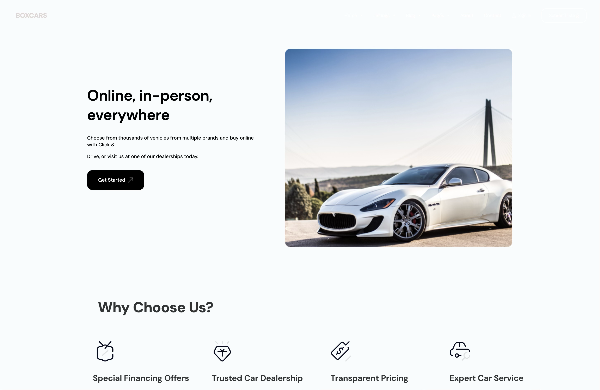

# BOXCARS

### Description
Automotive landing page developed in HTML and CSS from a Figma design. This project was created as part of my introduction to web development and allowed me to deepen my understanding of CSS fundamentals, particularly Flexbox, layout, responsive design, and structuring an interface from a design mockup.

**[Visit the website](https://box-cars.netlify.app/)**

### Web Preview

  
  

### Features

- Vehicle presentation
- Navigation between different sections
- Responsive interface
- Design adapted for mobile and desktop

### Technologies

`HTML` · `CSS`

### Mobile Preview

  
  
  

