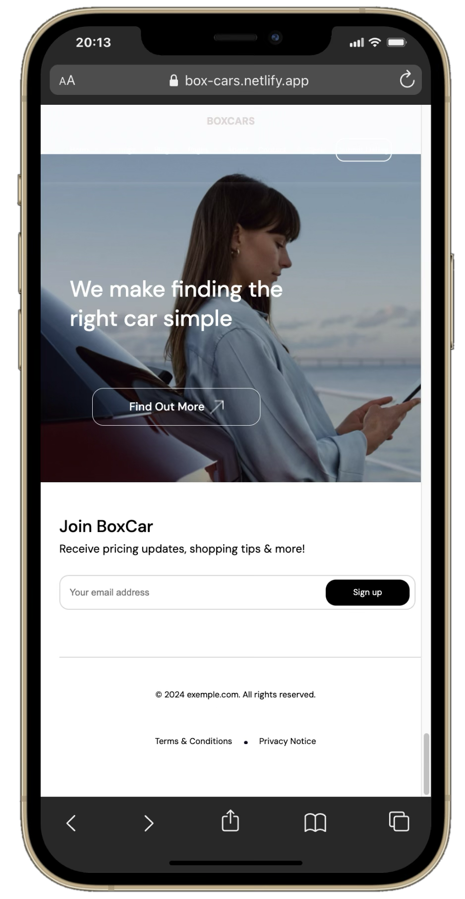
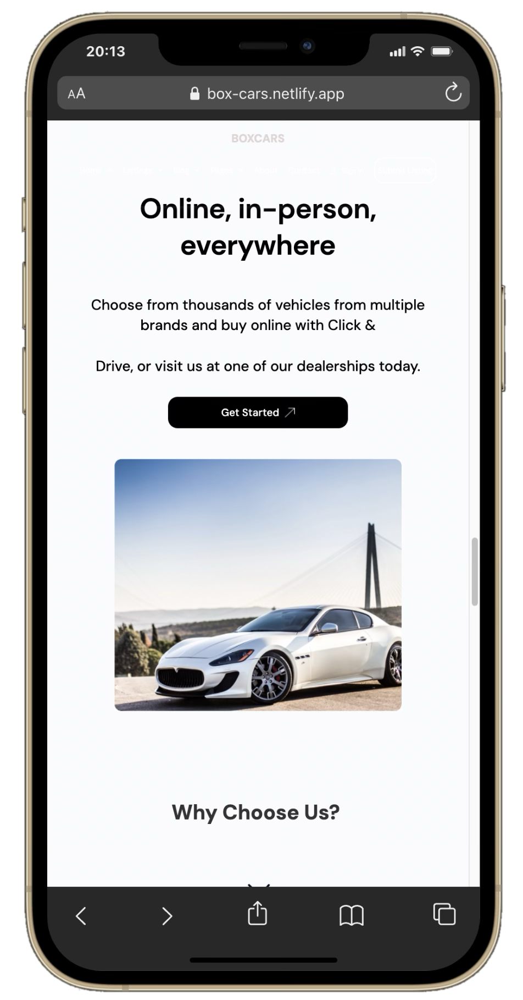

# BOXCARS

### Description
Landing page automobile développée en HTML et CSS à partir d’une maquette Figma. Ce projet a été réalisé dans le cadre de mon initiation au développement web et m’a permis d’approfondir les fondamentaux du CSS, notamment Flexbox, la mise en page, le responsive design et la structuration d’une interface à partir d’une maquette.

**[Visiter le site](https://box-cars.netlify.app/)**

### Aperçu web

  
  

### Fonctionnalités

- Présentation des véhicules
- Navigation entre les différentes sections
- Interface responsive
- Adaptation du design pour mobile et desktop

### Technologies

`HTML` · `CSS`

### Aperçu mobile

  
  
  

